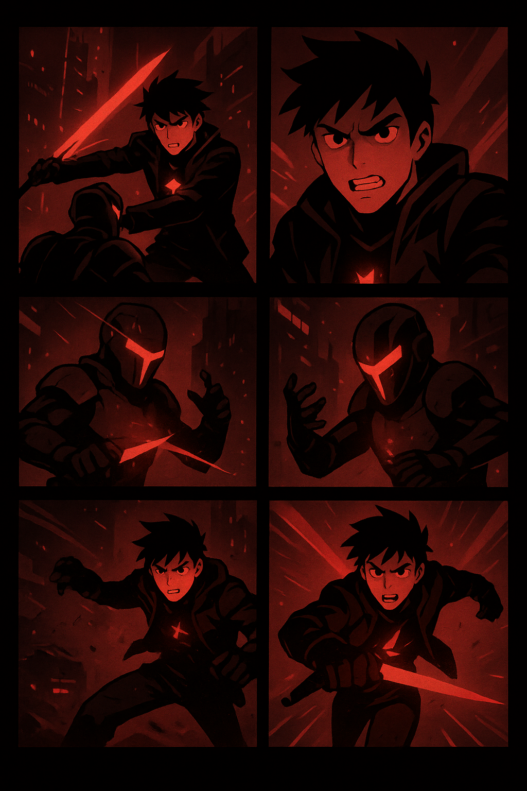

# 🌑 Luar Carmesim  

{:width="600px" height="auto"}  

---

## 🎬 Episódio 1 – O Despertar da Maldição  

> *"Na noite em que o sol morreu, apenas a lua permaneceu... tingida em vermelho eterno."*  

---

### 🏙️ CENA 1 – A Cidade em Ruínas
O cenário é um deserto de sombras e neon.  
Entre prédios quebrados e outdoors holográficos falhando, surge **Kairon**.  

🔻 **Narrador:**  
Kairon é um dos **Marcados pelo Luar Carmesim** — uma cicatriz incandescente em seu peito, que pulsa sempre que a lua se ergue no céu.  

---

### ⚔️ CENA 2 – A Dádiva e a Maldição
Kairon descobre que o poder não é um presente.  
Cada vez que usa sua energia, sua **vida é drenada** pouco a pouco.  

---

### 🌙 CENA 3 – O Encontro
Nas ruínas, ele encontra **Mireya**, uma guerreira marcada como ele.  

💬 **Mireya:**  
*"Os Marcados não são sobreviventes... somos peças de um jogo cruel.  
A lua nos escolheu, mas também nos amaldiçoou."*  

---

### 👁️‍🗨️ CENA 4 – A Chegada dos Caçadores
Surgem figuras encapuzadas: os **Caçadores**.  
Eles acreditam que **eliminar os Marcados** é a única forma de salvar o mundo.  

---

### 🔥 CENA 5 – O Primeiro Combate
Kairon ergue sua lâmina carmesim pela primeira vez.  
Chamas vermelhas explodem em volta, mas o peso do poder o consome.  

Mireya o ajuda a escapar, mas os Caçadores juram persegui-los até o fim.  

---

### 🌑 CENA 6 – O Segredo da Lua
O episódio termina com Kairon fitando o céu.  
Sua marca arde como fogo, e uma voz ecoa em sua mente:  

> *"A verdade está escondida no sangue da lua...  
e você será o próximo a descobri-la."*  

---

📺 *Continua no Episódio 2...*  
